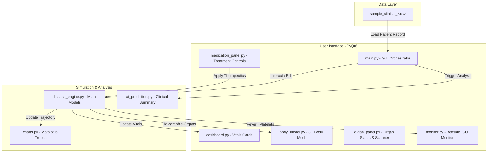

# 🧬 AI Digital Twin — Human Body Disease Simulator (v1.1.0)

[](https://www.python.org/)
[](https://riverbankcomputing.com/software/pyqt/)
[](https://matplotlib.org/)
[](https://opensource.org/licenses/MIT)

An interactive, high-fidelity PyQt6 desktop application simulating the physiological progression and treatment response of infectious diseases (**Malaria, Dengue Fever, and Chikungunya**). This platform features a contoured 3D humanoid body model with glowing holographic organs, a real-time vitals dashboard, clinical charts, an interactive organ detail scanner, and an AI Health Prediction Engine.

---

## 📸 System Overview



---

## ✨ Key Features

*   **🩻 Contoured 3D Humanoid Body Model**:
    *   **Anatomical Accuracy**: Tapered torso, neck, and limbs representing realistic proportions.
    *   **Holographic Organs**: Translucent glass-like body shell showcasing key internal organs (Brain, Heart, Lungs, Liver, Spleen, Kidneys, Joints, Muscles).
    *   **Interactive Selection**: Clicking an organ highlights/isolates it at `0.95 opacity` (with a wireframe mesh) while dimming others to `0.05 opacity`.
    *   **Dynamic Symptoms**: Visualized blood vessel congestion and skin rashes that scale with disease progression.
    *   **Advanced Camera**: Orbit, rotation, and non-clipping zoom (`0.4x` to `5.0x`).
*   **🩺 Real-Time Vitals ICU Monitor**:
    *   Tracks Temperature (°F), Heart Rate (bpm), Blood Pressure (mmHg), $\text{SpO}_2$ (%), Platelets, Hemoglobin, and WBC counts.
    *   Interactive second-by-second simulation clock with adjustable speed dials (`0.5x`, `1x`, `2x`, `5x`).
    *   Adaptive, clinical color-coded alert banners (Normal, Warning, Danger, Critical).
*   **📊 Interactive Clinical Charts & Scanner**:
    *   Matplotlib-backed panels rendering real-time trendlines of fever, blood metrics, and organ-specific risk.
    *   **Organ Scanner Tab**: High-resolution diagnostics showing cellular level metrics and localized symptoms.
*   **💊 Medication Panel & Treatment Overrides**:
    *   Apply targeted drugs (e.g., *Chloroquine* for Malaria, *Paracetamol* for fever, *IV Fluids*, *Platelet Transfusion*, *NSAIDs*, *Corticosteroids*).
    *   Observe immediate physiological responses and recovery trajectories.
*   **📂 CSV Patient Import Mode**:
    *   Load clinical patient datasets with automatic disease detection and telemetry interpolation.
    *   Run live therapeutic interventions overlaid on historical recordings.
*   **🧠 AI Health Prediction Engine**:
    *   Generates comprehensive medical analysis summaries detailing thermal regulation, organ defense status, recovery velocity, and side effect risks.

---

## 🚀 Installation & Setup

### 📋 Prerequisites
*   **Python 3.10** or higher
*   **pip** package manager

### 1. Install Dependencies
Clone the repository, navigate to the folder, and run:
```bash
pip install -r requirements.txt
```

### 2. Run the Simulator
Start the PyQt6 desktop interface:
```bash
python main.py
```
*(On Linux/macOS, you can run `./run.sh` directly)*

---

## 📁 Project Structure

| File | Description |
| :--- | :--- |
| **[`main.py`](file:///c:/Users/Manasvi/Downloads/digital_twin_app%20(1)/main.py)** | Main GUI window, layout orchestration, and Qt event connections. |
| **[`disease_engine.py`](file:///c:/Users/Manasvi/Downloads/digital_twin_app%20(1)/disease_engine.py)** | Core disease progression curves, equations, and incubation phases. |
| **[`body_model.py`](file:///c:/Users/Manasvi/Downloads/digital_twin_app%20(1)/body_model.py)** | 3D humanoid mesh generators, Matplotlib 3D plotting, and organ shaders. |
| **[`charts.py`](file:///c:/Users/Manasvi/Downloads/digital_twin_app%20(1)/charts.py)** | Matplotlib widget displaying Fever, Platelets, Vitals, and Organ Risk graphs. |
| **[`monitor.py`](file:///c:/Users/Manasvi/Downloads/digital_twin_app%20(1)/monitor.py)** | Real-time bedside ICU monitor simulation widget (second-by-second updates). |
| **[`dashboard.py`](file:///c:/Users/Manasvi/Downloads/digital_twin_app%20(1)/dashboard.py)** | Top/Side vitals display cards with dynamic hazard warnings. |
| **[`organ_panel.py`](file:///c:/Users/Manasvi/Downloads/digital_twin_app%20(1)/organ_panel.py)** | Interactive list of organs, health bars, and high-res scan details. |
| **[`medication_panel.py`](file:///c:/Users/Manasvi/Downloads/digital_twin_app%20(1)/medication_panel.py)** | Drug dosage buttons, active treatments list, and interactive toggles. |
| **[`ai_prediction.py`](file:///c:/Users/Manasvi/Downloads/digital_twin_app%20(1)/ai_prediction.py)** | Logic for analyzing status trends and writing AI clinical predictions. |
| **`sample_clinical_*.csv`** | Pre-bundled clinical patient data (Malaria, Dengue, Chikungunya). |

---

## ⚠️ Medical Disclaimer

> [!WARNING]
> **This software is for educational, research, and demonstration purposes only.**
> It is not a clinically validated medical tool and must **not** be used to diagnose, treat, or manage real-world medical conditions. It has not been evaluated or approved by any healthcare regulatory body.
